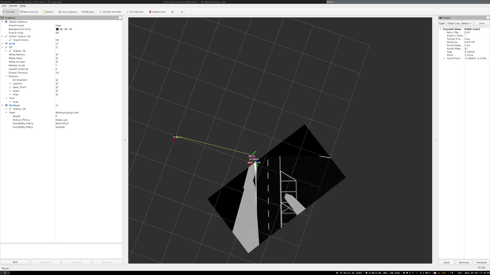

# RViz birdeye display

This package provides a plugin for RViz2 to visualize a "bird-eye" perspective image topic in the 3d view. The plugin
requires an image topic with type `sensor_msgs::msg::Image` and a topic with name `params` with type
[`spatz_interfaces::msg::BirdEyeParam`](https://github.com/teamspatzenhirn/spatz_interfaces/blob/master/msg/BirdEyeParam.msg)
in the same namespace.

